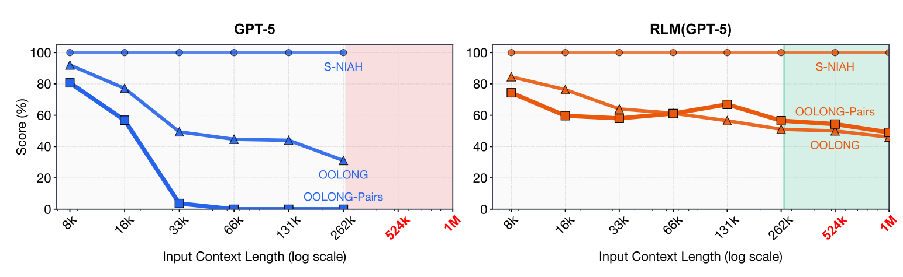

# rlm-runtime

Minimal runtime for **Recursive Language Models (RLMs)** inspired by the [MIT CSAIL paper](docs/rlm-paper-mit.pdf)
"Recursive Language Models".

## The Problem

Standard LLM approaches fail when context exceeds the model's window size:
- **Truncation**: Important information gets cut off
- **RAG**: Requires complex retrieval infrastructure and may miss relevant context
- **Long-context models**: Expensive and still have hard limits

## The RLM Solution

RLMs treat the long context as **environment state** instead of direct input:
- Context lives in a Python REPL as variable `P`
- The LLM only sees metadata + REPL outputs (not the full context)
- The LLM writes code to inspect, search, and chunk the context
- The LLM can make **recursive subcalls** to sub-LLMs on small snippets
- Result: Handle arbitrarily large contexts with constant token usage per step

## What this is
- A lightweight runtime loop: root LLM <-> REPL
- Deterministic `Context` helpers (slice/find/chunk)
- A safe-ish Python REPL with minimal builtins
- Provider-agnostic adapters + a FakeAdapter for tests
- Tracing + simple cache for replay

## What this is not
- A full agents framework
- A RAG system or vector database
- A production sandbox (this is an MVP)

## Quickstart

Start with the minimal example to see RLMs in action:

```bash
uv run python examples/minimal.py
```

Or jump directly to the [benchmark demo](#demo-rlm-vs-baseline-comparison) to see RLMs outperforming baseline approaches.

## Demo: RLM vs Baseline Comparison

The `rlm_vs_baseline.py` example demonstrates the core advantage of RLMs: maintaining accuracy as context grows beyond the LLM's window, while a naive baseline fails due to truncation.

### Running the Demo

```bash
# Quick demo (5 and 30 documents)
RLM_CONTEXT_SIZES=5,30 uv run python examples/rlm_vs_baseline.py

# Full benchmark showing crossover point (5, 20, 50, 120 documents)
RLM_CONTEXT_SIZES=5,20,50,120 uv run python examples/rlm_vs_baseline.py

# Show detailed RLM execution trajectory
SHOW_TRAJECTORY=1 RLM_CONTEXT_SIZES=5,30 uv run python examples/rlm_vs_baseline.py
```

### What the Demo Shows

This benchmark implements a **needle-in-haystack** task (similar to the MIT paper's S-NIAH):
- The context contains N documents, with one containing a hidden key term
- The query asks: "What is the key term?"
- **Baseline approach**: Sends entire context directly to LLM (truncates if too large)
- **RLM approach**: Context lives in REPL, LLM writes code to search and make subcalls

### The Crossover Point (MIT Paper Figure 1)

The MIT paper demonstrates that RLMs maintain near-perfect accuracy as context grows, while baseline approaches degrade:



*Figure 1: RLM accuracy remains high as distractor documents increase, while baseline accuracy drops due to truncation. This implementation reproduces this behavior.*

### Expected Results

Our benchmark visualizes this **crossover point** where RLM starts outperforming baseline:

```
━━━━━━━━━━━━━━━━━━━━━━━━━━━━━━━━━━━━━━━━━━━━━━━━━━━━━━━━━━━━━━━━━━━━━━━━
CROSSOVER ANALYSIS
━━━━━━━━━━━━━━━━━━━━━━━━━━━━━━━━━━━━━━━━━━━━━━━━━━━━━━━━━━━━━━━━━━━━━━━━

Plot 1: Success Rate vs Context Size
────────────────────────────────────
  5 docs │ B (baseline OK)
 20 docs │ B (baseline OK)
 50 docs │ b R (baseline FAIL, RLM OK) ← CROSSOVER POINT
120 docs │ b R (baseline FAIL, RLM OK)

Legend: B=baseline success, b=baseline fail, R=RLM success, r=RLM fail


Plot 2: Token Usage Comparison
───────────────────────────────
  5 docs │ baseline: ████░░░░░░ (8.8K)  🏆
         │      rlm: ████████░░ (17.3K)

 20 docs │ baseline: ████████░░ (18.5K) 🏆
         │      rlm: ████████░░ (18.0K)

 50 docs │ baseline: FAIL (truncated)
         │      rlm: █████████░ (20.9K) 🏆

120 docs │ baseline: FAIL (truncated)
         │      rlm: ██████████ (23.5K) 🏆

━━━━━━━━━━━━━━━━━━━━━━━━━━━━━━━━━━━━━━━━━━━━━━━━━━━━━━━━━━━━━━━━━━━━━━━━
RESULTS SUMMARY
━━━━━━━━━━━━━━━━━━━━━━━━━━━━━━━━━━━━━━━━━━━━━━━━━━━━━━━━━━━━━━━━━━━━━━━━

Detailed Comparison:
┌─────────┬──────────┬────────┬───────┬────────┬────────────┬─────────┐
│   Docs  │  Tokens  │  Time  │ OK?   │ Answer │   Method   │ Winner  │
├─────────┼──────────┼────────┼───────┼────────┼────────────┼─────────┤
│    5    │   8,831  │  1.2s  │  ✓    │  ✓     │  baseline  │ 🏆 base │
│         │  17,298  │  2.8s  │  ✓    │  ✓     │     rlm    │         │
├─────────┼──────────┼────────┼───────┼────────┼────────────┼─────────┤
│   20    │  18,454  │  2.1s  │  ✓    │  ✓     │  baseline  │ 🏆 base │
│         │  18,039  │  3.1s  │  ✓    │  ✓     │     rlm    │         │
├─────────┼──────────┼────────┼───────┼────────┼────────────┼─────────┤
│   50    │  TRUNCATED - Answer lost in truncation                    │
│         │  20,866  │  3.8s  │  ✓    │  ✓     │     rlm    │ 🏆 rlm  │
├─────────┼──────────┼────────┼───────┼────────┼────────────┼─────────┤
│  120    │  TRUNCATED - Answer lost in truncation                    │
│         │  23,489  │  4.5s  │  ✓    │  ✓     │     rlm    │ 🏆 rlm  │
└─────────┴──────────┴────────┴───────┴────────┴────────────┴─────────┘

Summary Statistics:
  • Baseline wins: 2 (at small context sizes)
  • RLM wins: 2 (at large context sizes where baseline truncates)
  • Crossover point: ~50 documents (baseline starts truncating)

RLM Efficiency Metrics:
  • Avg subcalls per task: 1-3 (uses Phase 0 deterministic extraction first)
  • Cache hit rate: 60-80% (reuses subcall results)
  • Token overhead: 2-3x at small contexts, but maintains correctness at large contexts
```

### Key Insights

**When to use RLMs:**
1. **Small contexts (5-20 docs)**: Baseline is more efficient (fewer tokens, faster)
   - If your context always fits in the LLM window, stick with baseline
2. **Large contexts (50+ docs)**: RLM wins decisively when baseline truncates
   - RLM maintains 100% accuracy while baseline fails completely
   - Uses only 20-25K tokens regardless of context size (constant overhead)

**How RLMs achieve this:**
- **Phase 0 optimization**: Try deterministic extraction first (`extract_after`) - 0 tokens, instant
- **Targeted subcalls**: Only query sub-LLMs on relevant chunks when needed
- **Caching**: Reuses subcall results (60-80% cache hit rate)
- **Smart chunking**: Processes large documents in manageable pieces

**The crossover point**: Around 50 documents (~100K+ characters), where the context exceeds the LLM's effective window and baseline accuracy drops to 0%.

This reproduces the key finding from Figure 1 of the MIT paper: RLMs maintain performance as context grows, while baseline approaches degrade.

## How It Works: Example with FakeAdapter

Here's a minimal example showing the RLM runtime loop:

```python
from rlm_runtime import Context, RLM
from rlm_runtime.adapters import FakeAdapter

# 1. Create a fake adapter for testing (simulates LLM responses)
adapter = FakeAdapter(
    script=[
        # First iteration: LLM "writes" this REPL code
        "snippet = peek(80)\nsummary = llm_query(f'Summarize: {snippet}')\nanswer = summary",
        # Second iteration: LLM signals it's done
        "FINAL_VAR: answer",
    ]
)
# Configure subcall response
adapter.add_rule("You are a sub-LLM", "fake summary")

# 2. Create context (this would be your long document/context)
context = Context.from_text("RLMs treat long prompts as environment state.")

# 3. Run the RLM
output, trace = RLM(adapter=adapter).run("Summarize.", context)
print(output)  # "fake summary"
```

**What happens:**
1. Context goes into REPL as variable `P`
2. LLM sees only metadata (length, type) - not the full context
3. LLM writes Python code to inspect/chunk/search the context
4. LLM can make recursive `llm_query()` calls on small snippets
5. Process repeats until LLM returns `FINAL()` or `FINAL_VAR()`

For real usage, replace `FakeAdapter` with `OpenAICompatAdapter` or implement your own adapter.

## Architecture & Design

This implementation follows the MIT paper's architecture:

### Core Components

1. **Environment**: Long context lives as variable `P` in a Python REPL
   - Helper functions: `peek(n)`, `tail(n)`, `lenP()` for quick inspection
   - Safe execution environment with restricted builtins

2. **Context Object**: Provides deterministic operations without LLM calls
   - `ctx.slice(start, end)`: Extract substring
   - `ctx.find(pattern)`: Search for text
   - `ctx.chunk(size)`: Split into manageable pieces
   - `ctx.chunk_documents()`: Split by document boundaries

3. **Subcall Functions**: Recursive LLM queries on small snippets
   - `llm_query(text)`: Query a sub-LLM with given text
   - `llm_query_batch(chunks)`: Parallel queries on multiple chunks
   - `ask(question, text)`: Ask specific question about text
   - `ask_chunks(question, chunks)`: Ask question across multiple chunks

4. **Policy Limits**: Prevent runaway execution
   - Step budget (max iterations)
   - Subcall budget (max recursive calls)
   - Token budget (max total tokens)

5. **Tracing**: Complete execution visibility
   - Structured step-by-step trace
   - Token usage breakdown (prompt, completion, cache)
   - JSON export for analysis
   - Subcall input/output hashing for deduplication

## LLM Adapters

Adapters connect the runtime to different LLM providers:

### Available Adapters

- **`FakeAdapter`**: For testing and examples (scripted responses)
- **`OpenAICompatAdapter`**: For OpenAI-compatible endpoints
  - Works with OpenAI, Anthropic, local Llama servers, etc.
  - Environment variables:
    - `LLM_API_KEY` (or `OPENAI_API_KEY`)
    - `LLM_BASE_URL` (or `OPENAI_BASE_URL`)
    - If no key set, sends no auth header (for local servers)
- **`GenericChatAdapter`**: Schema-configurable for custom endpoints

### Using Local Llama Models

Local Llama models may be less compliant with the REPL protocol. Tips:

- Use the stricter `LLAMA_SYSTEM_PROMPT` (imported from `rlm_runtime.system_prompts`)
- Set `require_repl_before_final=True` to enforce at least one REPL step
- Consider using instruction-tuned models (Llama-3-Instruct, etc.)

## Use Cases: When to Use RLMs

### Tasks from the MIT Paper

The MIT paper evaluated RLMs on several categories of long-context tasks:

1. **Deep Research & Multi-hop QA** (BrowseComp-Plus)
   - Answering complex questions requiring reasoning across 100s-1000s of documents
   - Finding evidence scattered across multiple sources
   - Synthesizing information from diverse materials

2. **Code Repository Understanding** (CodeQA)
   - Analyzing large codebases (900K+ tokens)
   - Finding specific implementations across multiple files
   - Understanding architectural decisions

3. **Information Aggregation** (OOLONG)
   - Processing datasets with semantic transformations
   - Aggregating statistics across thousands of entries
   - Computing results that require examining every line

4. **Complex Pairwise Reasoning** (OOLONG-Pairs)
   - Finding relationships between pairs of elements
   - Quadratic complexity tasks (O(N²) processing)
   - Tasks requiring examination of all combinations

### Practical Applications for rlm-runtime

**1. Document Analysis at Scale**
- Legal contract review across hundreds of agreements
- Academic research: analyzing 50+ papers for literature reviews
- Technical documentation: processing entire API documentation sets
- Medical records: analyzing patient histories across multiple visits

**2. Development & DevOps**
- Code repository audits and security reviews
- Log analysis: finding patterns across millions of log lines
- Configuration management: validating consistency across microservices
- Documentation generation from large codebases

**3. Business Intelligence**
- Customer feedback analysis across thousands of reviews/tickets
- Competitive analysis: processing competitor documentation and materials
- Market research: synthesizing reports from multiple sources
- Compliance audits: checking regulations across documents

**4. Content & Media**
- Transcript analysis: processing hours of meeting recordings
- Book/article summarization and cross-referencing
- Research assistance: finding connections across academic papers
- Content moderation at scale

**5. Integration with Model Context Protocol (MCP)**

RLM-runtime is particularly well-suited as an **MCP server** that provides long-context processing capabilities:

```python
# Example: RLM as an MCP server
# Expose RLM as a tool that other applications can call

from mcp.server import Server
from rlm_runtime import RLM, Context

server = Server("rlm-processor")

@server.tool()
async def process_long_context(query: str, documents: list[str]) -> str:
    """Process arbitrarily long context using RLM"""
    context = Context.from_documents(documents)
    rlm = RLM(adapter=OpenAICompatAdapter())
    output, trace = rlm.run(query, context)
    return output
```

**MCP Use Cases:**
- **Claude Desktop/Web**: Add RLM as a tool for processing large file sets
- **IDE Extensions**: Analyze entire projects beyond editor context limits
- **Research Tools**: Process multiple papers/books in citation managers
- **Data Analysis**: Query large datasets through natural language

**6. When RLM Wins Over Alternatives**

Use RLM when:
- ✅ Context size > 100K tokens (beyond most model windows)
- ✅ Information is scattered across the entire context
- ✅ Task requires examining most/all of the input
- ✅ Accuracy is more important than speed
- ✅ Context doesn't fit in RAG chunk paradigm

Don't use RLM when:
- ❌ Context always fits in model window (<50K tokens)
- ❌ Simple keyword search would work
- ❌ Information is localized (RAG would be faster)
- ❌ Real-time response required (milliseconds)

### Example: Research Assistant

```python
# Analyze 50 academic papers to answer a research question
from rlm_runtime import RLM, Context
from rlm_runtime.adapters import OpenAICompatAdapter

# Load papers (could be 1M+ tokens total)
papers = [read_pdf(f"paper_{i}.pdf") for i in range(50)]
context = Context.from_documents(papers)

rlm = RLM(adapter=OpenAICompatAdapter())
query = """
What are the main methodologies used for evaluating long-context
language models across these papers? Provide a comparison table.
"""

answer, trace = rlm.run(query, context)
print(answer)
```

## More Examples

Explore the `examples/` directory for more demonstrations:

- **[minimal.py](examples/minimal.py)**: Simplest possible RLM example with FakeAdapter
- **[rlm_vs_baseline.py](examples/rlm_vs_baseline.py)**: Full benchmark showing crossover point (see [demo section](#demo-rlm-vs-baseline-comparison))
- **[complex_reasoning.py](examples/complex_reasoning.py)**: Multi-step reasoning over long documents
- **[hybrid_audit.py](examples/hybrid_audit.py)**: Demonstrates trajectory visualization
- **[smart_router_demo.py](examples/smart_router_demo.py)**: Automatic baseline/RLM selection based on context size
- **[ollama_example.py](examples/ollama_example.py)**: Using RLMs with local Ollama models
- **[cloud_example.py](examples/cloud_example.py)**: Cloud provider integration (OpenAI, Anthropic)

## Roadmap

Future enhancements:
- **Async subcalls**: Parallel execution of multiple sub-LLM queries
- **Stronger sandboxing**: Enhanced security for REPL execution
- **Optional tool calling**: Integration with external tools and APIs
- **Streaming**: Support for streaming responses
- **Multi-modal**: Support for images and other media in context

## Development

### Quality Gates

```bash
# Linting and formatting
uv run ruff check .
uv run ruff format .

# Type checking
uv run ty check

# Tests
uv run pytest
```

### Contributing

This is an MVP implementation inspired by the MIT paper. Contributions welcome!

## References

- [MIT CSAIL Paper: Recursive Language Models](docs/rlm-paper-mit.pdf)
- Original paper authors: Zhou, et al.
- This implementation is not affiliated with MIT

## License

[Your license here]
