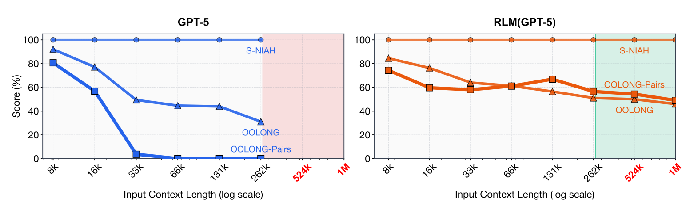

# pyrlm-runtime

Minimal Python runtime for **Recursive Language Models (RLMs)** — inspired by the [MIT CSAIL paper](docs/rlm-paper-mit.pdf) _"Recursive Language Models"_.

RLMs solve the long-context problem: instead of sending huge contexts directly to an LLM (which truncates or degrades), the context lives as **environment state** in a Python REPL. The LLM writes code to inspect, search, and chunk the data, making **recursive subcalls** to smaller models when needed. Result: handle arbitrarily large contexts with constant token usage per step.

## Table of Contents

- [Installation](#installation)
- [Quickstart](#quickstart)
- [Live Rich Trace](#live-rich-trace)
- [Core Concepts](#core-concepts)
- [API Reference](#api-reference)
  - [RLM](#rlm)
  - [Context](#context)
  - [Adapters](#adapters)
  - [Policy](#policy)
  - [Trace](#trace)
  - [Cache](#cache)
  - [Router](#router)
- [REPL Backends](#repl-backends)
- [REPL Functions Available to the LLM](#repl-functions-available-to-the-llm)
- [Parallel Subcalls](#parallel-subcalls)
- [Multi-Turn Conversation History](#multi-turn-conversation-history)
- [Guard Mechanisms & Fallbacks](#guard-mechanisms--fallbacks)
- [Configuration](#configuration)
- [Examples](#examples)
- [When to Use RLMs](#when-to-use-rlms)
- [Benchmark: RLM vs Baseline](#benchmark-rlm-vs-baseline)
- [Development](#development)
- [References](#references)
- [License](#license)

## Installation

```bash
pip install pyrlm-runtime
```

Or with [uv](https://docs.astral.sh/uv/):

```bash
uv add pyrlm-runtime
```

For live terminal visualization of the REPL loop with `rich`:

```bash
pip install "pyrlm-runtime[rich]"
```

**Requirements:** Python 3.12+

**Optional:** For the secure Monty REPL backend (Rust sandbox):

```bash
pip install pydantic-monty
```

## Quickstart

### 1. Set your API key

```bash
export LLM_API_KEY="your-api-key-here"
# Optional: custom endpoint (Ollama, LM Studio, etc.)
# export LLM_BASE_URL="http://localhost:11434/v1"
```

### 2. Basic usage

```python
from pyrlm_runtime import RLM, Context
from pyrlm_runtime.adapters import OpenAICompatAdapter

# Create context from your documents
documents = [
    "Document 1: Very long content...",
    "Document 2: More content...",
    # ... could be 100s of documents, millions of tokens
]
context = Context.from_documents(documents)

# Initialize RLM with an adapter
adapter = OpenAICompatAdapter(model="gpt-4")
rlm = RLM(adapter=adapter)

# Ask questions over the entire context
answer, trace = rlm.run("What are the main themes across all documents?", context)
print(answer)
```

### 3. Run without external APIs (for testing)

```python
from pyrlm_runtime import RLM, Context
from pyrlm_runtime.adapters import FakeAdapter

adapter = FakeAdapter(script=[
    "snippet = peek(80)\nsummary = llm_query(f'Summarize: {snippet}')\nanswer = f'Summary -> {summary}'",
    "FINAL_VAR: answer",
])
adapter.add_rule("You are a sub-LLM", "[fake] short summary")

context = Context.from_text("RLMs treat long prompts as environment state.")
output, trace = RLM(adapter=adapter).run("Summarize this.", context)
print(output)  # Summary -> [fake] short summary
```

## Live Rich Trace

```python
from rich.console import Console

from pyrlm_runtime import Context, RLM
from pyrlm_runtime.adapters import FakeAdapter
from pyrlm_runtime.rich_trace import RichTraceListener

console = Console()
listener = RichTraceListener(console=console)

adapter = FakeAdapter(
    script=[
        "snippet = peek(40)\nsummary = llm_query(f'Summarize: {snippet}')\nprint(summary)\nanswer = summary",
        "FINAL_VAR: answer",
    ]
)
adapter.add_rule("You are a sub-LLM", "[fake] summary")

output, trace = RLM(adapter=adapter, event_listener=listener).run(
    "Summarize the first chunk.",
    Context.from_text("RLMs treat long prompts as environment state."),
)
```

With a real Azure OpenAI deployment:

```python
from dotenv import load_dotenv

from pyrlm_runtime import Context, RLM
from pyrlm_runtime.adapters import AzureOpenAIAdapter
from pyrlm_runtime.rich_trace import RichTraceListener

load_dotenv()

adapter = AzureOpenAIAdapter(model="gpt-5.1")
listener = RichTraceListener()

output, trace = RLM(adapter=adapter, event_listener=listener).run(
    "Which launch had the largest revenue?",
    Context.from_text(demo_text),
)
```

Azure env contract for the live demo:

```bash
AZURE_OPENAI_API_KEY="..."
OPENAI_ENDPOINT="https://your-resource.openai.azure.com"
# or: AZURE_ACCOUNT_NAME="your-resource"
AZURE_OPENAI_API_VERSION="2024-10-21"  # optional

uv run python examples/rich_repl_demo.py --model gpt-5.1
```

## Core Concepts

### How the RLM loop works

```
rlm.run(query, context)
  │
  ├── 1. Initialize REPL with context as variables `P` (text) and `ctx` (Context object)
  ├── 2. Build system prompt + user message with context metadata
  │
  └── 3. Loop (until FINAL or max_steps):
        │
        ├── LLM generates Python code (or FINAL answer)
        │
        ├── If code → execute in REPL sandbox
        │   ├── Code can call peek(), ctx.find(), ctx.chunk(), etc.
        │   ├── Code can call llm_query() / ask_chunks() for subcalls
        │   └── REPL output is sent back to LLM as next iteration
        │
        └── If FINAL → return answer
            ├── "FINAL: <answer>"        → inline answer
            ├── "FINAL_VAR: <varname>"   → return REPL variable value
            └── auto_finalize_var        → return when variable is set

Return: (output: str, trace: Trace)
```

### Finalization

The LLM signals completion in three ways:

| Method              | Example                                    | When to use                      |
| ------------------- | ------------------------------------------ | -------------------------------- |
| `FINAL: <text>`     | `FINAL: The answer is 42`                  | Short inline answers             |
| `FINAL_VAR: <name>` | `FINAL_VAR: result`                        | Return a REPL variable           |
| `auto_finalize_var` | `RLM(adapter, auto_finalize_var="answer")` | Auto-return when variable is set |

## API Reference

### RLM

The main entry point. Orchestrates the REPL loop, subcalls, and conversation history.

```python
from pyrlm_runtime import RLM

rlm = RLM(
    adapter,                            # Required: LLM adapter (see Adapters)
    policy=None,                        # Resource limits (see Policy)
    cache=None,                         # Subcall cache (see Cache)
    max_tokens=512,                     # Max tokens per LLM call
    system_prompt=BASE_SYSTEM_PROMPT,   # Override system prompt

    # REPL backend
    repl_backend="python",              # "python" (default) or "monty"

    # Conversation history
    conversation_history=True,          # Multi-turn mode (default: True)
    max_history_tokens=0,               # Token budget for history (0=unlimited)

    # Subcalls
    subcall_adapter=None,               # Separate (cheaper) adapter for subcalls
    recursive_subcalls=False,           # Subcalls run mini-RLM loops
    max_recursion_depth=2,              # Max recursion depth
    parallel_subcalls=False,            # Run subcalls in parallel

    # Guards & fallbacks
    require_repl_before_final=False,    # Enforce ≥1 REPL execution
    require_subcall_before_final=False, # Enforce ≥1 subcall
    invalid_response_limit=None,        # Max retries on non-code responses
    fallback_code=None,                 # Emergency code if LLM stalls
)

output, trace = rlm.run(query="Your question", context=context)
```

### Context

Wraps your data and provides safe inspection methods for the REPL.

```python
from pyrlm_runtime import Context

# From a single text
context = Context.from_text("Your long text here...")

# From multiple documents (separated by markers)
context = Context.from_documents([
    "Document 1 content...",
    "Document 2 content...",
    "Document 3 content...",
], separator="\n---DOC_BOUNDARY---\n")

# Available methods (used by the LLM inside the REPL):
context.len_chars()                    # Total character count
context.num_documents()                # Number of documents
context.get_document(index)            # Get a specific document
context.document_lengths()             # List of document lengths
context.slice(start, end)             # Safe substring
context.find(pattern, regex=False)    # Search with optional regex
context.chunk(size, overlap=0)        # Split into chunks
context.chunk_documents(docs_per_chunk=10)  # Group documents into chunks
context.metadata()                    # Summary dict for system prompts
```

### Adapters

Adapters connect pyrlm-runtime to any LLM provider.

#### OpenAICompatAdapter

Works with OpenAI, Anthropic (via proxy), Ollama, LM Studio, vLLM, and any OpenAI-compatible API.

```python
from pyrlm_runtime.adapters import OpenAICompatAdapter

# OpenAI
adapter = OpenAICompatAdapter(model="gpt-4")

# Ollama (local)
adapter = OpenAICompatAdapter(
    model="llama3",
    base_url="http://localhost:11434/v1",
)

# Any OpenAI-compatible endpoint
adapter = OpenAICompatAdapter(
    model="my-model",
    base_url="https://my-endpoint.com/v1",
)
```

Uses environment variables: `LLM_API_KEY` (or `OPENAI_API_KEY`), `LLM_BASE_URL`.

#### GenericChatAdapter

For non-standard APIs with custom request/response formats.

```python
from pyrlm_runtime.adapters import GenericChatAdapter

adapter = GenericChatAdapter(
    base_url="https://custom-api.com",
    path="/chat/completions",
    model="custom-model",
    api_key="your-key",
    payload_builder=my_custom_builder,    # Custom request format
    response_parser=my_custom_parser,     # Custom response format
    timeout=60.0,
    max_retries=3,
)
```

Auto-retries on 429, 500, 502, 503, 504 with exponential backoff. Supports context manager (`with GenericChatAdapter(...) as adapter:`).

#### FakeAdapter

Deterministic adapter for testing. No external API needed.

```python
from pyrlm_runtime.adapters import FakeAdapter

adapter = FakeAdapter(
    script=["code step 1", "code step 2", "FINAL_VAR: result"]
)
# Pattern-based rules for subcall responses
adapter.add_rule(pattern="Summarize", response="This is a summary")
adapter.add_rule(pattern=r"find.*key", response="key_term", regex=True)
```

#### Custom adapters

Implement the `ModelAdapter` protocol:

```python
from pyrlm_runtime.adapters import ModelAdapter, ModelResponse

class MyAdapter:
    def complete(
        self,
        messages: list[dict[str, str]],
        max_tokens: int = 512,
        temperature: float = 0.0,
    ) -> ModelResponse:
        # Call your LLM and return a ModelResponse
        ...
```

### Policy

Controls resource limits to prevent runaway execution.

```python
from pyrlm_runtime import Policy

policy = Policy(
    max_steps=40,              # Max RLM loop iterations
    max_subcalls=200,          # Max total subcalls
    max_recursion_depth=1,     # Max subcall nesting depth
    max_total_tokens=200_000,  # Token budget (root + subcalls)
    max_subcall_tokens=None,   # Token budget for subcalls only
)

rlm = RLM(adapter=adapter, policy=policy)
```

Raises specific exceptions when limits are exceeded: `MaxStepsExceeded`, `MaxSubcallsExceeded`, `MaxRecursionExceeded`, `MaxTokensExceeded`.

### Trace

Records every step of the RLM execution for debugging and analysis.

```python
output, trace = rlm.run(query, context)

# Inspect steps
for step in trace.steps:
    print(f"Step {step.step_id}: {step.kind}")
    if step.code:
        print(f"  Code: {step.code[:100]}")
    if step.stdout:
        print(f"  Output: {step.stdout[:100]}")
    if step.error:
        print(f"  Error: {step.error}")

# Serialize
json_str = trace.to_json()
trace_restored = Trace.from_json(json_str)
```

Step kinds: `root_call`, `repl_exec`, `subcall`, `recursive_subcall`, `sub_root_call`, `sub_repl_exec`, `sub_subcall`.

### Cache

File-based cache for subcall results. Avoids repeating identical LLM calls.

```python
from pyrlm_runtime import FileCache

cache = FileCache(root="./cache")
rlm = RLM(adapter=adapter, cache=cache)
```

### Router

Automatically selects between baseline (direct LLM call) and RLM based on context size.

```python
from pyrlm_runtime import SmartRouter, RouterConfig, ExecutionProfile

router = SmartRouter(
    adapter,
    config=RouterConfig(baseline_threshold=8000),  # chars
)

result = router.run(query, context, profile=ExecutionProfile.DETERMINISTIC_FIRST)
print(f"Method: {result.method}")   # "baseline" or "rlm"
print(f"Answer: {result.output}")
print(f"Tokens: {result.tokens_used}")
```

**Execution profiles:**

| Profile               | Strategy                                          |
| --------------------- | ------------------------------------------------- |
| `DETERMINISTIC_FIRST` | Try regex/`extract_after` first, minimal subcalls |
| `SEMANTIC_BATCHES`    | Parallel subcalls for classification tasks        |
| `HYBRID`              | Deterministic first, fall back to semantic        |
| `VERIFY`              | Double-check with recursive subcalls              |

## REPL Backends

pyrlm-runtime ships with two interchangeable REPL backends:

### PythonREPL (default)

Uses `exec()` with a whitelist sandbox. Allowed modules: `re`, `math`, `json`, `textwrap`. Stdout capped at 4000 chars.

```python
rlm = RLM(adapter=adapter, repl_backend="python")
```

### MontyREPL (secure sandbox)

Uses [pydantic-monty](https://github.com/pydantic/pydantic-monty), a Rust-based Python interpreter with compile-time safety. Enforces resource limits: 5s duration, 128MB memory, 1M allocations.

```python
# Requires: pip install pydantic-monty
rlm = RLM(adapter=adapter, repl_backend="monty")
```

**How MontyREPL handles complex objects:** Python objects like `Context` can't run natively in the Rust sandbox. MontyREPL uses an **object proxy** system — methods are registered as external functions with `{name}__{method}` naming, and AST rewrites transform `ctx.method()` calls into `ctx__method()` calls transparently.

**Variable persistence:** MontyREPL uses AST-based detection of assignments, appending a capture dict to extract variable state from each execution.

Both backends implement the same `REPLProtocol` interface: `exec(code) -> ExecResult`, `get(name)`, `set(name, value)`.

## REPL Functions Available to the LLM

When the LLM generates code during the RLM loop, these functions are available in the REPL:

### Context inspection

```python
P                              # The full context text (str)
ctx                            # The Context object

peek(n=2000)                   # First n chars of context
tail(n=2000)                   # Last n chars of context
lenP()                         # Total character count

ctx.slice(start, end)          # Safe substring
ctx.find(pattern, regex=False) # Search (returns list of matches)
ctx.chunk(size, overlap=0)     # Split into char-based chunks
ctx.chunk_documents(docs_per_chunk=10)  # Group documents
ctx.num_documents()            # Document count
ctx.get_document(index)        # Get specific document
ctx.document_lengths()         # List of doc lengths
```

### Subcalls (call sub-LLMs)

```python
llm_query(text, model=None, max_tokens=256)
    # Single subcall to a sub-LLM

llm_batch(prompts, model=None, max_tokens=256)
    # Process multiple prompts in parallel (always parallel, uses ThreadPoolExecutor)
    # → Use this for independent batch operations
    # Example: llm_batch(["prompt1", "prompt2", "prompt3"])

llm_query_batch(chunks, model=None, max_tokens=256, parallel=None)
    # Batch subcall over multiple chunks
    # → Parallel if parallel_subcalls=True or parallel=True (default: sequential)

ask(question, text, max_tokens=256)
    # Convenience: ask a question about a text snippet

ask_chunks(question, chunks, max_tokens=256, parallel=None)
    # Ask the same question over multiple chunks
    # → Parallel if parallel_subcalls=True or parallel=True (default: sequential)

ask_chunks_first(question, chunks, ...)
    # Return first valid (non-empty) answer from chunks (always sequential)

pick_first_answer(answers)
    # Filter and return first non-empty answer from a list
```

**Parallelization note:**

- `llm_batch()` always runs in parallel via ThreadPoolExecutor
- `ask_chunks()` and `llm_query_batch()` run:
  - **Sequential by default** (unless `RLM(parallel_subcalls=True)` or `ask_chunks(..., parallel=True)`)
  - **Parallel when enabled** (limited to `max_concurrent_subcalls`, default 10 workers)

### Deterministic extraction

```python
extract_after(marker, max_len=128)
    # Extract text after a marker without using a subcall (fast, 0 tokens)
```

## Parallel Subcalls

See the detailed architecture guide: **[docs/PARALLEL_SUBCALLS.md](docs/PARALLEL_SUBCALLS.md)**

### Quick Summary

pyrlm-runtime supports three ways to parallelize LLM subcalls:

1. **`llm_batch(prompts)`** — Always parallel, best for independent prompts:

   ```python
   results = llm_batch(["Q1?", "Q2?", "Q3?"])  # All 3 run in parallel
   ```

2. **`ask_chunks(..., parallel=True)`** — Opt-in per-call:

   ```python
   answers = ask_chunks("Q?", chunks, parallel=True)  # Chunks processed in parallel
   ```

3. **`RLM(..., parallel_subcalls=True)`** — Global flag:
   ```python
   rlm = RLM(adapter, parallel_subcalls=True)  # All ask_chunks calls are parallel
   ```

**Why parallel?** LLM API calls are I/O-bound. Making 10 requests sequentially takes ~20s; in parallel, ~2s.

**Thread safety:** All parallel execution is protected by locks on `Policy`, `Trace`, and step ID counters.

**Limits:** Default 10 concurrent workers (`max_concurrent_subcalls`); adjust per your API's rate limits.

## Multi-Turn Conversation History

By default (`conversation_history=True`), the LLM sees its previous code attempts and REPL outputs across iterations. This enables self-correction.

```python
rlm = RLM(
    adapter=adapter,
    conversation_history=True,      # Default
    max_history_tokens=4000,        # Optional token budget (0=unlimited)
)
```

**How it works:**

1. The initial message contains full query + context metadata
2. Each iteration appends a lightweight message with REPL results
3. Token trimming (if configured) always preserves system + initial user message, dropping oldest middle turns

## Guard Mechanisms & Fallbacks

For robustness, RLM supports several guard mechanisms:

```python
rlm = RLM(
    adapter=adapter,

    # Require at least 1 REPL execution before accepting FINAL
    require_repl_before_final=True,

    # Require at least 1 subcall before accepting FINAL
    require_subcall_before_final=True,

    # Max non-code responses before giving up
    invalid_response_limit=5,

    # Emergency code to run if LLM stalls
    fallback_code="answer = pick_first_answer(ask_chunks('answer?', ctx))",
)
```

## Configuration

### Environment variables

```bash
# API key (checked in order)
LLM_API_KEY="your-key"        # Primary
OPENAI_API_KEY="your-key"     # Fallback

# Azure OpenAI
AZURE_OPENAI_API_KEY="your-key"
OPENAI_ENDPOINT="https://your-resource.openai.azure.com"
# or: AZURE_ACCOUNT_NAME="your-resource"
AZURE_OPENAI_API_VERSION="2024-10-21"  # optional

# Custom endpoint (optional)
LLM_BASE_URL="https://..."

# For local models (no auth needed)
LLM_BASE_URL="http://localhost:11434/v1"  # Ollama
```

### Common configurations by use case

| Use case                       | Configuration                                                     |
| ------------------------------ | ----------------------------------------------------------------- |
| Small context (<8K chars)      | Use `SmartRouter` — it will pick baseline automatically           |
| Large context (>100K chars)    | `RLM(adapter, conversation_history=True, parallel_subcalls=True)` |
| Batch many independent prompts | Use `llm_batch(prompts)` — always parallel, no config needed      |
| Cost-sensitive                 | Use a cheaper `subcall_adapter` for subcalls                      |
| Safety-critical code execution | `repl_backend="monty"`                                            |
| Deterministic extraction       | `SmartRouter` with `DETERMINISTIC_FIRST` profile                  |
| Complex multi-hop reasoning    | `recursive_subcalls=True, max_recursion_depth=2`                  |

### Supported providers

| Provider      | Setup                                                                       |
| ------------- | --------------------------------------------------------------------------- |
| **Azure**     | `AzureOpenAIAdapter(model="gpt-5.1")` + `AZURE_OPENAI_API_KEY` + endpoint   |
| **OpenAI**    | `OpenAICompatAdapter(model="gpt-4")` + `LLM_API_KEY`                        |
| **Anthropic** | Via OpenAI-compatible proxy                                                 |
| **Ollama**    | `OpenAICompatAdapter(model="llama3", base_url="http://localhost:11434/v1")` |
| **LM Studio** | `OpenAICompatAdapter(model="...", base_url="http://localhost:1234/v1")`     |
| **vLLM**      | `OpenAICompatAdapter(model="...", base_url="http://localhost:8000/v1")`     |
| **Custom**    | `GenericChatAdapter(...)` or implement `ModelAdapter`                       |

## Examples

| Example                                                                   | Description                                                   | Requires API? |
| ------------------------------------------------------------------------- | ------------------------------------------------------------- | ------------- |
| [`minimal.py`](examples/minimal.py)                                       | Basic RLM flow with FakeAdapter                               | No            |
| [`rlm_vs_baseline.py`](examples/rlm_vs_baseline.py)                       | Needle-in-haystack benchmark (MIT paper Figure 1)             | Yes           |
| [`smart_router_demo.py`](examples/smart_router_demo.py)                   | SmartRouter auto-selecting baseline vs RLM by context size    | Yes           |
| [`bench_repl_python_vs_monty.py`](examples/bench_repl_python_vs_monty.py) | Raw REPL performance: PythonREPL vs MontyREPL (no LLM calls)  | No            |
| [`bench_rlm_repl_backends.py`](examples/bench_rlm_repl_backends.py)       | Full RLM loop benchmark with both REPL backends (FakeAdapter) | No            |

Run any example:

```bash
uv run python examples/minimal.py
```

## When to Use RLMs

**Use RLM when:**

- Context size exceeds the model's window (>100K tokens)
- Information is scattered across the entire context
- The task requires examining most or all of the input
- Accuracy matters more than latency
- Context doesn't fit the RAG chunk paradigm

**Don't use RLM when:**

- Context always fits in the model window (<50K tokens)
- Simple keyword search would work
- Information is localized (RAG is faster)
- Real-time response is required (milliseconds)

## Benchmark: RLM vs Baseline

The [`rlm_vs_baseline.py`](examples/rlm_vs_baseline.py) example reproduces the key finding from the MIT paper (Figure 1): RLMs maintain accuracy as context grows, while baseline approaches degrade due to truncation.



_Figure 1: RLM accuracy remains high as distractor documents increase, while baseline accuracy drops._

### Running the benchmark

```bash
# Quick demo
RLM_CONTEXT_SIZES=5,30 uv run python examples/rlm_vs_baseline.py

# Full benchmark
RLM_CONTEXT_SIZES=5,20,50,120 uv run python examples/rlm_vs_baseline.py

# With detailed execution trajectory
SHOW_TRAJECTORY=1 RLM_CONTEXT_SIZES=5,30 uv run python examples/rlm_vs_baseline.py
```

### The crossover point

Around ~50 documents (~100K+ characters), the context exceeds the LLM's window and baseline accuracy drops to 0%. RLM maintains near-perfect accuracy by inspecting the context via code instead of sending it all as input.

## Development

```bash
# Install dependencies
uv sync

# Run tests
uv run pytest

# Lint and format
uv run ruff check src/ tests/
uv run ruff format src/ tests/
```

## References

- [MIT CSAIL Paper: Recursive Language Models](docs/rlm-paper-mit.pdf) — Zhou, et al.
- This implementation is not affiliated with MIT.

## License

MIT License — see [LICENSE](LICENSE) for details.
